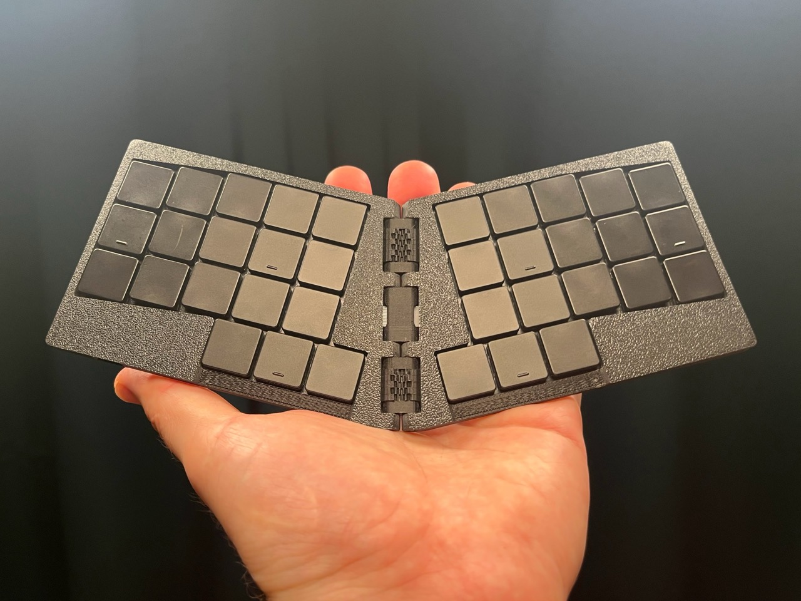
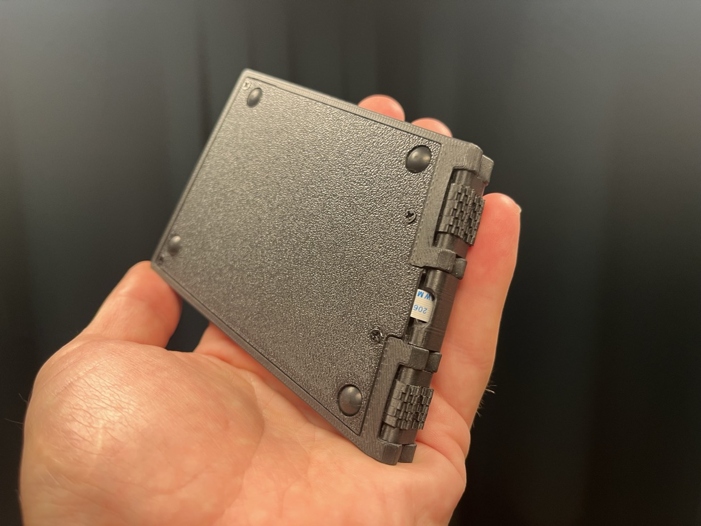
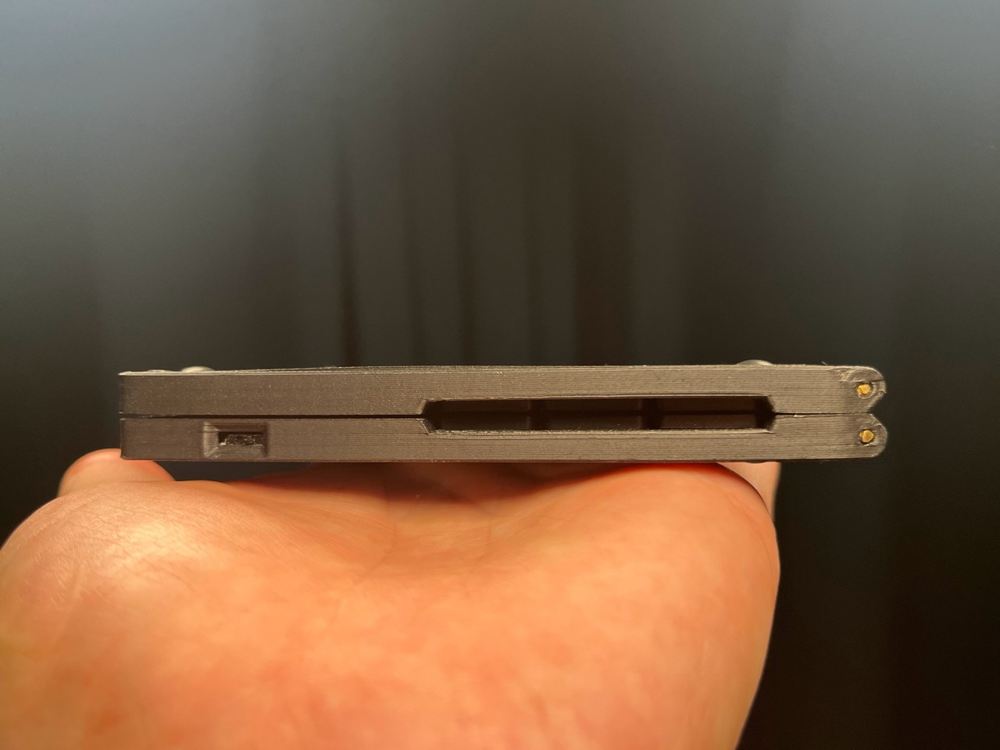

# Aronia Keyboard

A 36-key, ultra-compact, foldable, ergonomic keyboard. It's designed to be as small as possible while remaining comfortable for typing. When folded, the keyboard measures only 100x100x12mm and weighs 115g.

> [!WARNING]
> The current prototypes are functional but not perfect. Soldering the switches on a hot plate is extremely challenging. Be prepared for multiple attempts and have spare switches on hand.

## Hardware

The hardware is designed in the [KiCad](https.org/) EDA suite. The PCB is designed with components available from the JLCPCB assembly service. The power supply and MCU module selection are heavily inspired by the [nRFMicro](https://github.com/joric/nrfmicro) project.

## Firmware

The firmware is based on the [ZMK project](https://zmkfirmware.dev/) and uses a layout based on [Miryoku](https://github.com/manna-harbour/miryoku). The source code is available at [https://github.com/kumekay/miryoku_zmk](https://github.com/kumekay/miryoku_zmk).

## Bill of Materials (BOM) for final assembly

- 1x PCB (fully soldered)
- 2mm brass rod (for the axle), ~20cm
- 3D-printed parts:
  - 1x Left top case
  - 1x Right top case
  - 1x Left bottom cover
  - 1x Right bottom cover
  - 1x Cable pass-through
  - 4x Half connectors
  - 11x Gear A
  - 11x Gear B
- 8x M2x6 screws

## Assembly Instructions

At this stage, the assembly process is not straightforward. This project is an early prototype, and not all assembly steps are fully documented.

## License

This project is licensed under the CERN Open Hardware Licence Version 2 - Strongly Reciprocal. See the [LICENSE](LICENSE) file for details.

## Additional Information

> [!NOTE]
> The original working name for this project was "mymikla" ("My Milujeme Klávesnici," which is Czech for "We Love Keyboards"). Some files may still use this name.

## Couple more photos

